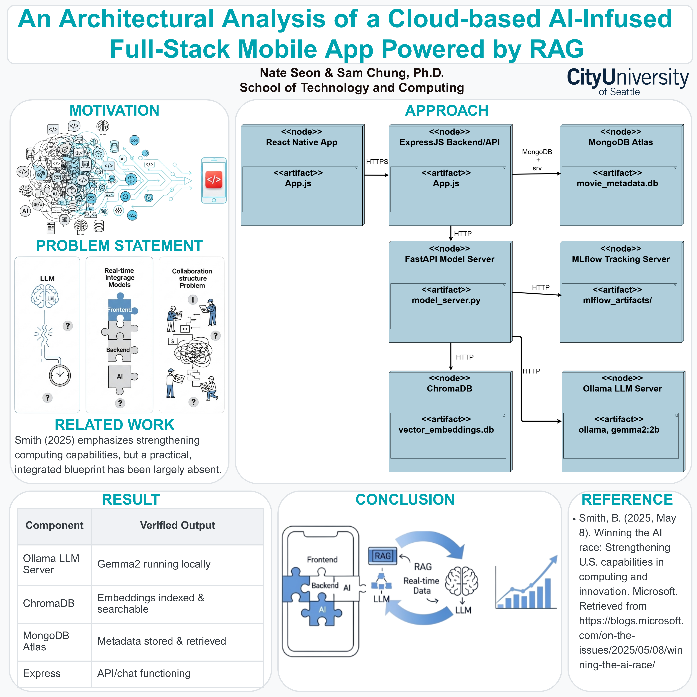

# An Architectural Analysis of a Cloud-based AI-Infused Full-Stack Mobile App Powered by RAG

<div align="center">


</div>

**Authors:** Nate Seon, Sam Chung, Ph.D.

---

## 📝 Abstract

> This research presents and analyzes a deployment architecture for a cloud-based, Generative AI-powered mobile application using Retrieval-Augmented Generation (RAG). We propose a practical blueprint that integrates a local LLM (Gemma 2) with a full-stack framework (React Native, Express.js) to enhance team collaboration and provide a clear architectural understanding. The goal is to demonstrate an efficient, secure, and scalable model for developing modern AI-infused applications.

## 🏛️ System Architecture

<div align="center">
  
</div>

<details>
<summary>💻 Click to see the full Technology Stack</summary>

- **Frontend**: React Native
- **Backend**: Express.js
- **Database**: MongoDB Atlas
- **LLM**: Gemma 2 (via Ollama)
- **Vector DB**: ChromaDB
- **MLOps**: MLflow
- **Model Server**: FastAPI

</details>

## 📁 Repository Contents

This repository contains the primary materials for our research accepted at UKC 2025:

- [`UKC2025_SeungwonSeon.pdf`](./UKC2025_SeungwonSeon.pdf): The full research paper detailing the implementation and analysis.
- [`Poster - Poster Design (48 x 48 in).jpg`](./Poster%20-%20Poster%20Design%20(48%20x%2048%20in).jpg): The poster presented at the conference.

## 📚 Citation

<details>
<summary>Show BibTeX Citation</summary>

```bibtex
@inproceedings{seon2025architectural,
  title={An Architectural Analysis of a Cloud-based AI-Infused Full-Stack Mobile App Powered by RAG},
  author={Seon, Nate and Chung, Sam},
  booktitle={U.S.-Korea Conference on Science, Technology, and Entrepreneurship (UKC 2025)},
  year={2025}
}
